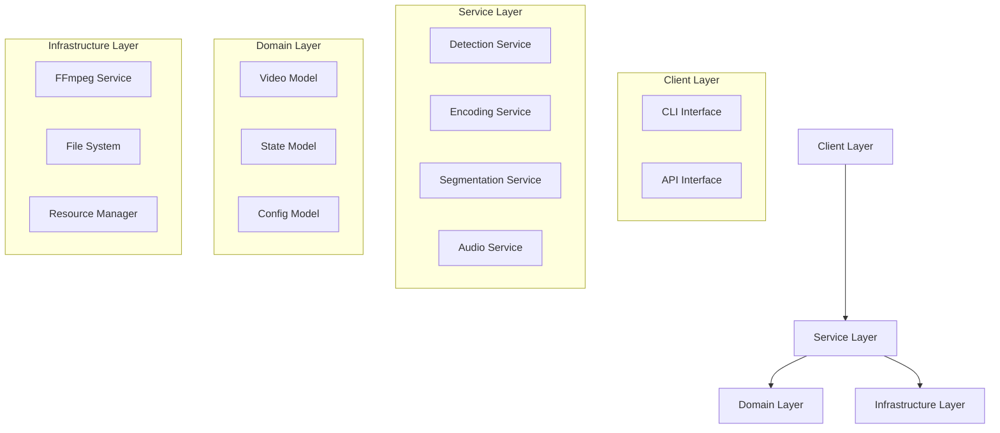
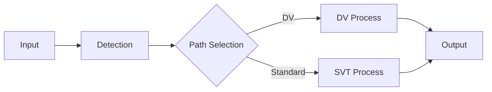
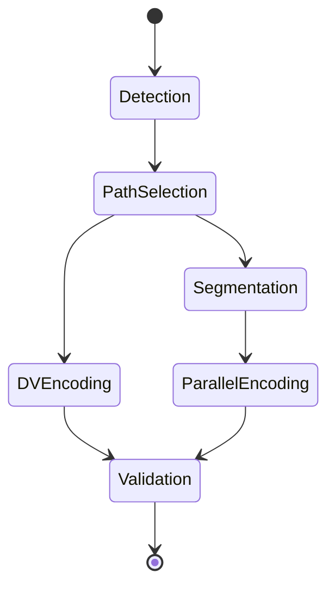
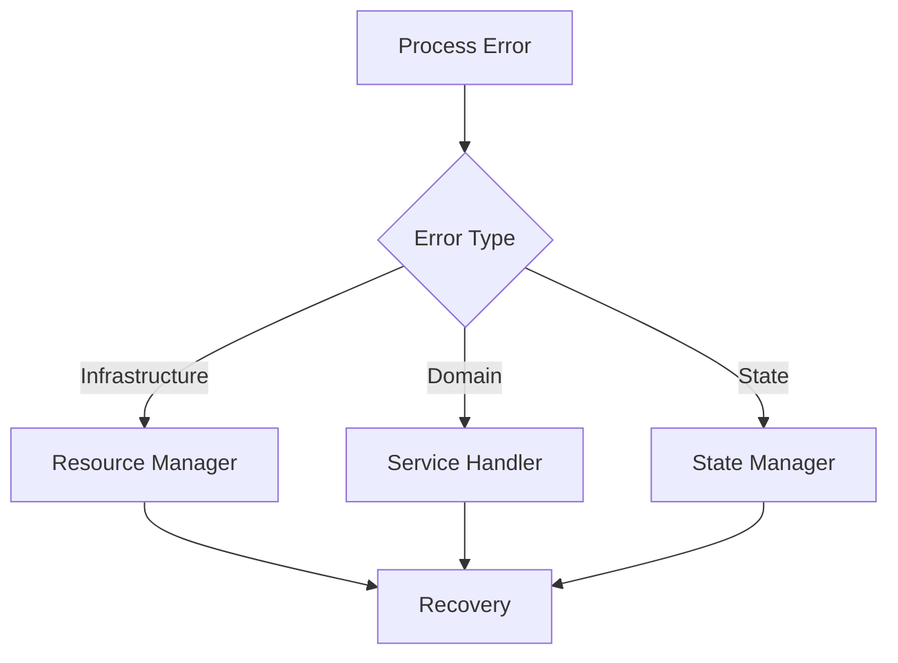

# Drapto Architecture

## System Overview
Drapto is a video encoding workflow system that processes videos through segmentation, encoding, and quality analysis. This document describes the high-level architecture and component interactions.

## Core Architecture

### 1. Domain Services


### 2. Service Boundaries

#### Detection Service
- Video analysis
- Format detection
- Quality assessment
- Stream analysis

#### Encoding Service
- Dolby Vision path
- SVT-AV1 path
- Quality control
- Resource management

#### Segmentation Service
- Video splitting
- Segment management
- Concatenation
- Validation

#### State Management
- Process tracking
- State transitions
- Recovery points
- Resource tracking

## Component Interactions

### 1. Process Flow


### 2. State Transitions


## Resource Management

### 1. Resource Hierarchy
```
ResourceManager
├── WorkspaceManager
│   ├── TemporaryFiles
│   └── ProcessArtifacts
├── SystemResources
│   ├── CPU
│   └── Memory
└── ExternalTools
    ├── FFmpeg
    └── SVT-AV1
```

### 2. Resource Lifecycle
- Acquisition
- Monitoring
- Release
- Cleanup

## Configuration Management

### 1. Configuration Hierarchy
```
Config
├── SystemConfig
│   ├── Resources
│   └── Paths
├── EncodingConfig
│   ├── DVSettings
│   └── SVTSettings
└── ProcessConfig
    ├── Segmentation
    └── Validation
```

### 2. Validation Chain
- Schema validation
- Dependency validation
- Resource validation
- Runtime validation

## Error Handling

### 1. Error Boundaries


### 2. Recovery Mechanisms
- State rollback
- Resource cleanup
- Process retry
- Graceful degradation

## Testing Architecture

### 1. Test Layers
```
Tests
├── Unit
│   ├── Services
│   └── Domain
├── Integration
│   ├── Workflows
│   └── Resources
└── System
    ├── End-to-End
    └── Performance
```

### 2. Test Resources
- Mock services
- Test data
- Resource simulation
- State verification

## Deployment

### 1. Package Structure
```
drapto/
├── core/
├── services/
├── infrastructure/
├── state/
├── config/
└── cli/
```

### 2. Dependencies
- Runtime dependencies
- Development dependencies
- External tools
- System requirements

## Performance Considerations

### 1. Resource Optimization
- Memory management
- CPU utilization
- I/O optimization
- Parallel processing

### 2. Monitoring
- Resource usage
- Process states
- Error rates
- Performance metrics
