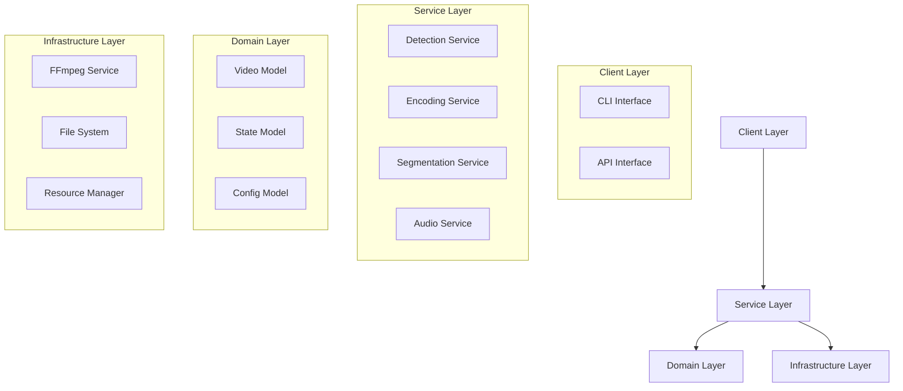
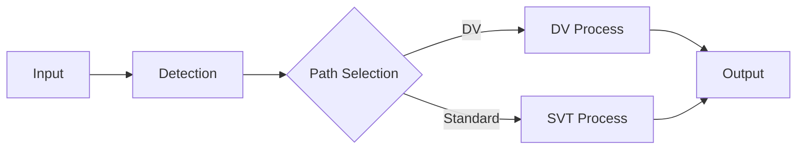
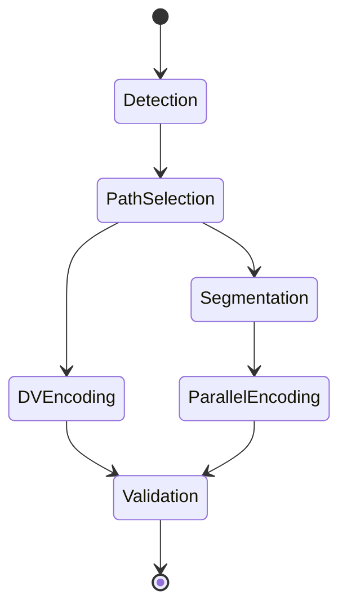
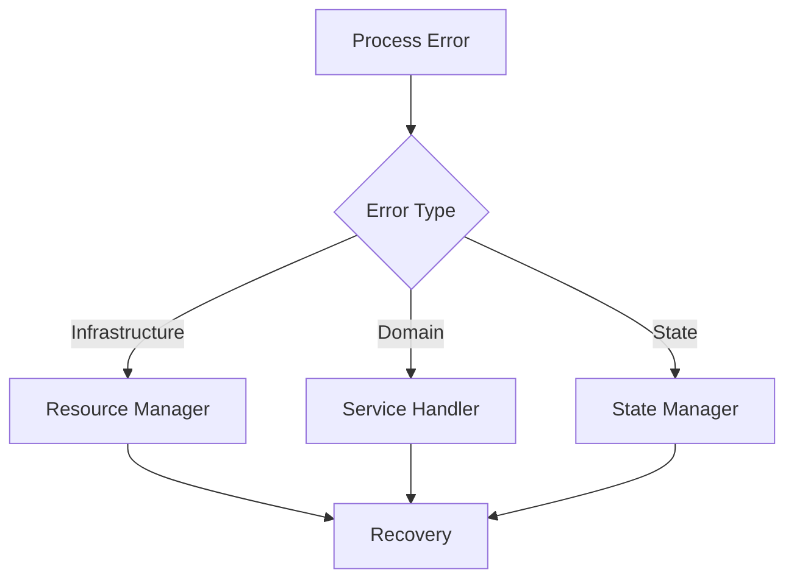

# Drapto Architecture

## System Overview
Drapto is a video encoding workflow system that processes videos through segmentation, encoding, and quality analysis. This document describes the high-level architecture, component interactions, and implementation details.

## Core Design Principles

1. **Path-Specific Architecture**
   - Clear separation between Dolby Vision and Chunked encoding paths
   - Common interfaces for shared functionality
   - Strategy pattern for encoding path selection
   - Factory pattern for path instantiation

2. **Resource Management**
   - Centralized resource monitoring
   - Proactive cleanup strategies
   - Disk space management
   - Memory usage optimization

3. **Error Recovery**
   - Unified error handling
   - Retry strategies with backoff
   - Graceful degradation options
   - State recovery mechanisms

4. **Progress Reporting**
   - Structured logging hierarchy
   - Clear progress indicators
   - Command visibility
   - Log level organization

## Core Architecture

### 1. Domain Services


### 2. Service Boundaries

#### Detection Service
- Video analysis
- Format detection
- Quality assessment
- Stream analysis

#### Encoding Service
- Dolby Vision path
- SVT-AV1 path
- Quality control
- Resource management

#### Segmentation Service
- Video splitting
- Segment management
- Concatenation
- Validation

#### State Management
- Process tracking
- State transitions
- Recovery points
- Resource tracking

## Component Interactions

### 1. Process Flow


### 2. State Transitions


## Implementation Details

### Directory Structure

```
drapto/
├── encoding/
│   ├── base.py           # Base classes and interfaces
│   ├── dolby_vision.py   # Dolby Vision implementation
│   ├── chunked.py        # Chunked encoding implementation
│   └── factory.py        # Path selection logic
│
├── resources/
│   ├── monitor.py        # CPU/Memory monitoring
│   ├── disk.py          # Disk space management
│   └── cleanup.py       # Temporary file handling
│
├── reporting/
│   ├── logger.py        # Centralized logging
│   ├── progress.py      # Progress tracking
│   └── formatter.py     # Output formatting
│
├── processors/
│   ├── audio.py         # Audio processing
│   ├── video.py         # Video processing
│   └── subtitle.py      # Subtitle processing
│
└── utils/
    ├── validation.py    # Input/output validation
    ├── config.py        # Configuration management
    └── paths.py         # Path management
```

### Key Components

#### 1. Encoding Strategy
```python
from abc import ABC, abstractmethod
from typing import Protocol

class EncodingPath(Protocol):
    """Interface for encoding paths."""
    
    async def validate_input(self) -> bool:
        """Validate input content for this path."""
        ...
    
    async def encode(self) -> bool:
        """Execute the encoding process."""
        ...
    
    async def validate_output(self) -> bool:
        """Validate encoded output."""
        ...

class BaseEncoder(ABC):
    """Base class for encoders."""
    
    def __init__(self):
        self._logger = logging.getLogger(self.__class__.__name__)
        self._monitor = ResourceMonitor()
    
    @abstractmethod
    async def encode_content(self) -> bool:
        """Implement encoding logic."""
        pass

class DolbyVisionEncoder(BaseEncoder):
    """Dolby Vision specific encoder."""
    
    async def encode_content(self) -> bool:
        """Implement Dolby Vision encoding."""
        try:
            self._logger.info("Starting Dolby Vision encoding")
            # Implementation
            return True
        except Exception as e:
            self._logger.error(f"Dolby Vision encoding failed: {e}")
            return False

class ChunkedEncoder(BaseEncoder):
    """Chunked encoding implementation."""
    
    async def encode_content(self) -> bool:
        """Implement chunked encoding."""
        try:
            self._logger.info("Starting chunked encoding")
            # Implementation
            return True
        except Exception as e:
            self._logger.error(f"Chunked encoding failed: {e}")
            return False
```

#### 2. Resource Management
```python
class ResourceMonitor:
    """Monitor and manage system resources."""
    
    def __init__(self):
        self._logger = logging.getLogger(__name__)
        self._thresholds = self._load_thresholds()
    
    async def check_resources(self) -> bool:
        """Check if sufficient resources are available."""
        cpu_ok = await self._check_cpu_usage()
        mem_ok = await self._check_memory_usage()
        disk_ok = await self._check_disk_space()
        return all([cpu_ok, mem_ok, disk_ok])
    
    async def cleanup(self):
        """Clean up temporary resources."""
        try:
            # Implementation
            pass
        except Exception as e:
            self._logger.error(f"Cleanup failed: {e}")
```

#### 3. Progress Reporting
```python
class ProgressTracker:
    """Track and report encoding progress."""
    
    def __init__(self):
        self._logger = logging.getLogger(__name__)
        self._start_time = time.time()
        self._tasks: Dict[str, TaskStatus] = {}
    
    def update_progress(self, task: str, progress: float):
        """Update task progress."""
        self._tasks[task] = TaskStatus(
            progress=progress,
            elapsed=time.time() - self._start_time
        )
        self._log_progress(task)
    
    def _log_progress(self, task: str):
        """Log progress update."""
        status = self._tasks[task]
        self._logger.info(
            f"{task}: {status.progress:.1f}% "
            f"[{status.elapsed:.1f}s elapsed]"
        )
```

## Resource Management

### 1. Resource Hierarchy
```
ResourceManager
├── WorkspaceManager
│   ├── TemporaryFiles
│   └── ProcessArtifacts
├── SystemResources
│   ├── CPU
│   └── Memory
└── ExternalTools
    ├── FFmpeg
    └── SVT-AV1
```

### 2. Resource Lifecycle
- Acquisition
- Monitoring
- Release
- Cleanup

## Configuration Management

### 1. Configuration Hierarchy
```
Config
├── SystemConfig
│   ├── Resources
│   └── Paths
├── EncodingConfig
│   ├── DVSettings
│   └── SVTSettings
└── ProcessConfig
    ├── Segmentation
    └── Validation
```

### 2. Validation Chain
- Schema validation
- Dependency validation
- Resource validation
- Runtime validation

## Error Handling

### 1. Error Boundaries


### 2. Recovery Mechanisms
- State rollback
- Resource cleanup
- Process retry
- Graceful degradation

## Testing Architecture

### 1. Test Layers
```
Tests
├── Unit
│   ├── Services
│   └── Domain
├── Integration
│   ├── Workflows
│   └── Resources
└── System
    ├── End-to-End
    └── Performance
```

### 2. Test Resources
- Mock services
- Test data
- Resource simulation
- State verification

## Deployment

### 1. Package Structure
```
drapto/
├── core/
├── services/
├── infrastructure/
├── state/
├── config/
└── cli/
```

### 2. Dependencies
- Runtime dependencies
- Development dependencies
- External tools
- System requirements

## Performance Considerations

### 1. Resource Optimization
- Memory management
- CPU utilization
- I/O optimization
- Parallel processing

### 2. Monitoring
- Resource usage
- Process states
- Error rates
- Performance metrics

## Migration Strategy

1. **Feature Flags**
   - Enable gradual rollout
   - Allow easy rollback
   - Support A/B testing
   - Monitor performance

2. **Validation**
   - Compare output quality
   - Verify performance
   - Check resource usage
   - Validate error handling

3. **Documentation**
   - Update user guides
   - Add API documentation
   - Document error codes
   - Add examples
