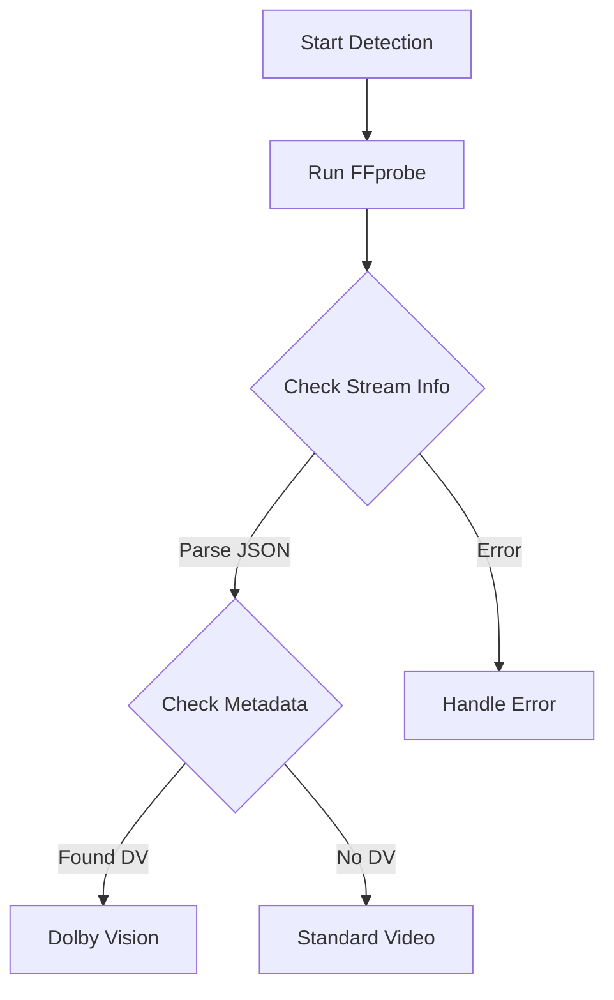
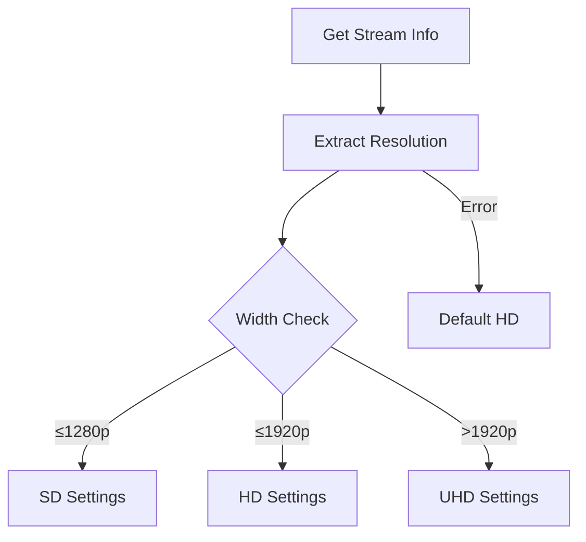
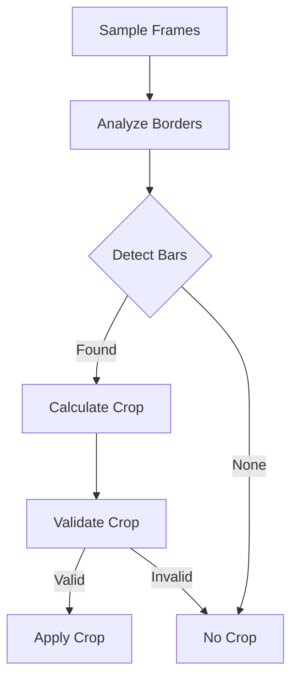

# Video Detection Processes

## 1. Dolby Vision Detection



### Process Details
1. **FFprobe Analysis**
   - Uses FFprobe with JSON output
   - Examines video stream metadata
   - Checks specific Dolby Vision markers

2. **Detection Markers**
   - `dvhe` codec tag
   - `dovi_profile` metadata
   - Color space indicators
   - HDR format flags

3. **Error Handling**
   - Invalid file format
   - Corrupted metadata
   - Missing stream info

## 2. Resolution Detection



### Process Details
1. **Resolution Extraction**
   - FFprobe stream analysis
   - Width/height parsing
   - Aspect ratio check

2. **Quality Settings**
   - SD (≤1280p): Lower CRF, faster preset
   - HD (≤1920p): Balanced settings
   - UHD (>1920p): Higher quality focus

3. **Configuration Impact**
   ```python
   # Resolution-based CRF
   crf_sd: int  # For width ≤ 1280
   crf_hd: int  # For width ≤ 1920
   crf_uhd: int # For width > 1920
   ```

## 3. Black Bar Detection



### Process Details
1. **Sampling Process**
   - Extract frame samples
   - Multiple sample points
   - Time-based distribution

2. **Analysis Algorithm**
   - Pixel value analysis
   - Threshold detection
   - Consistency check

3. **Crop Calculation**
   - Determine crop values
   - Maintain aspect ratio
   - Validate dimensions

4. **Validation Checks**
   - Minimum resolution
   - Even dimensions
   - Aspect ratio preservation

### Implementation Notes
```python
# Crop detection command
ffmpeg -i input -vf cropdetect -f null -
```

### Error Prevention
1. **Conservative Cropping**
   - Minimum black bar threshold
   - Multiple frame verification
   - Safety margins

2. **Validation Rules**
   - Maximum crop percentage
   - Minimum output size
   - Aspect ratio limits
