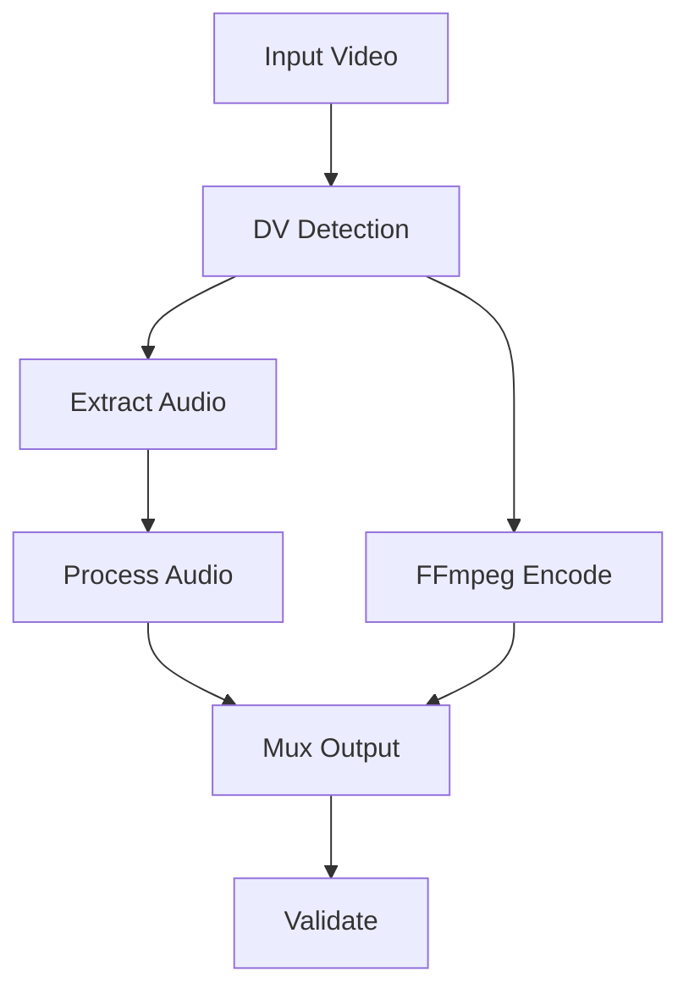
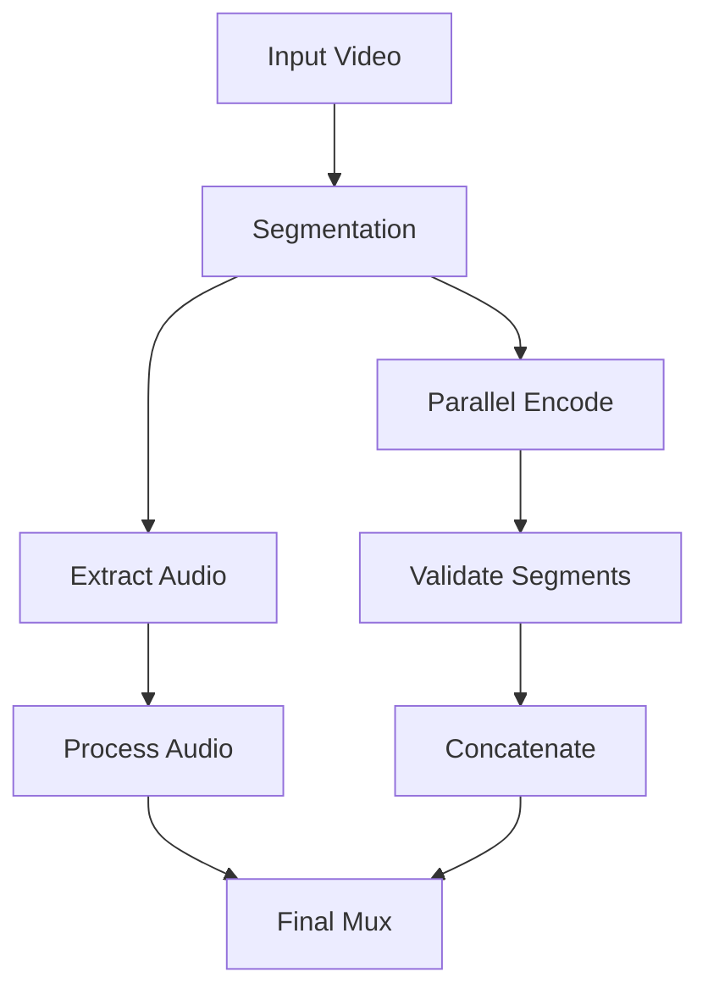

# Encoding Paths Documentation

## 1. Dolby Vision Path



### Process Details

1. **Initial Setup**
   ```python
   # Work directory structure
   work_dir/
   ├── audio/
   │   └── audio.opus
   ├── video.mkv
   └── final.mkv
   ```

2. **Audio Processing**
   - Extract audio streams
   - Convert to Opus format
   - Preserve channel layout
   - Maintain synchronization

3. **Video Encoding**
   ```bash
   # FFmpeg encoding command structure
   ffmpeg -i input.mkv \
     [hw_accel_options] \
     [video_filters] \
     -c:v libsvtav1 \
     [dv_options] \
     [encoding_params] \
     output.mkv
   ```

4. **Final Muxing**
   - Combine video and audio
   - Preserve DV metadata
   - Copy subtitles
   - Add chapters

### Quality Control
1. **Pre-encoding Checks**
   - DV profile validation
   - HDR metadata
   - Color space verification

2. **Post-encoding Validation**
   - DV metadata preservation
   - Stream integrity
   - Audio sync

## 2. Chunked SVT-AV1 Path



### Process Details

1. **Work Directory Structure**
   ```python
   work_dir/
   ├── segments/
   │   ├── segment_000.mkv
   │   ├── segment_001.mkv
   │   └── ...
   ├── encoded/
   │   ├── encoded_000.mkv
   │   ├── encoded_001.mkv
   │   └── ...
   ├── audio/
   │   └── audio.opus
   └── final.mkv
   ```

2. **Segmentation Process**
   - Scene detection
   - Fixed-length segments
   - Keyframe alignment
   - Metadata preservation

3. **Parallel Encoding**
   ```python
   # Worker configuration
   {
       'max_workers': cpu_count,
       'segment_timeout': timeout_seconds,
       'retry_limit': max_retries
   }
   ```

4. **Quality Settings**
   ```python
   # Resolution-based settings
   quality_params = {
       'sd': {'crf': crf_sd, 'preset': preset_sd},
       'hd': {'crf': crf_hd, 'preset': preset_hd},
       'uhd': {'crf': crf_uhd, 'preset': preset_uhd}
   }
   ```

### Implementation Details

1. **Segment Encoding**
   ```bash
   # SVT-AV1 encoding command
   ffmpeg -i segment.mkv \
     [hw_accel_options] \
     [video_filters] \
     -c:v libsvtav1 \
     [quality_params] \
     [svt_params] \
     encoded_segment.mkv
   ```

2. **Parallel Processing**
   - Dynamic worker allocation
   - Progress monitoring
   - Error handling
   - Resource management

3. **Segment Validation**
   - Duration check
   - Frame integrity
   - Quality metrics
   - Stream consistency

4. **Concatenation**
   ```python
   # Concat file structure
   file 'encoded_000.mkv'
   file 'encoded_001.mkv'
   ...
   ```

### Quality Assurance

1. **Per-Segment Checks**
   - Frame count
   - Duration match
   - Bitrate verification
   - VMAF sampling

2. **Final Validation**
   - Total duration
   - Stream consistency
   - Audio sync
   - Quality metrics

## Common Components

### 1. Resource Management
```python
# Resource limits
{
    'max_memory': '80%',
    'max_cpu': cpu_count - 1,
    'min_free_space': '10GB'
}
```

### 2. Error Handling
1. **Recovery Strategies**
   - Automatic retry
   - Parameter adjustment
   - Fallback options

2. **Cleanup Procedures**
   - Remove temp files
   - Free resources
   - Update status

### 3. Progress Monitoring
```python
# Progress structure
{
    'stage': str,
    'progress': float,
    'eta': int,
    'current_file': str
}
```
