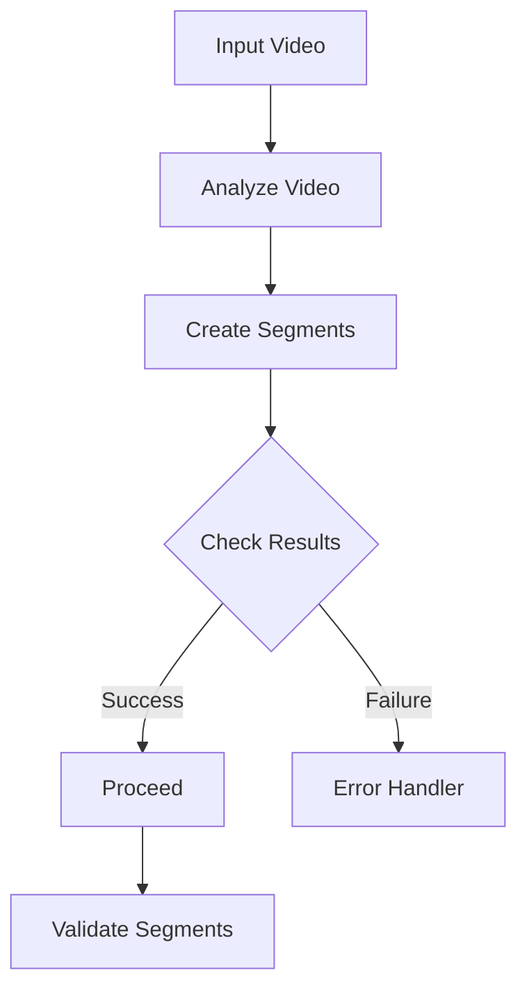
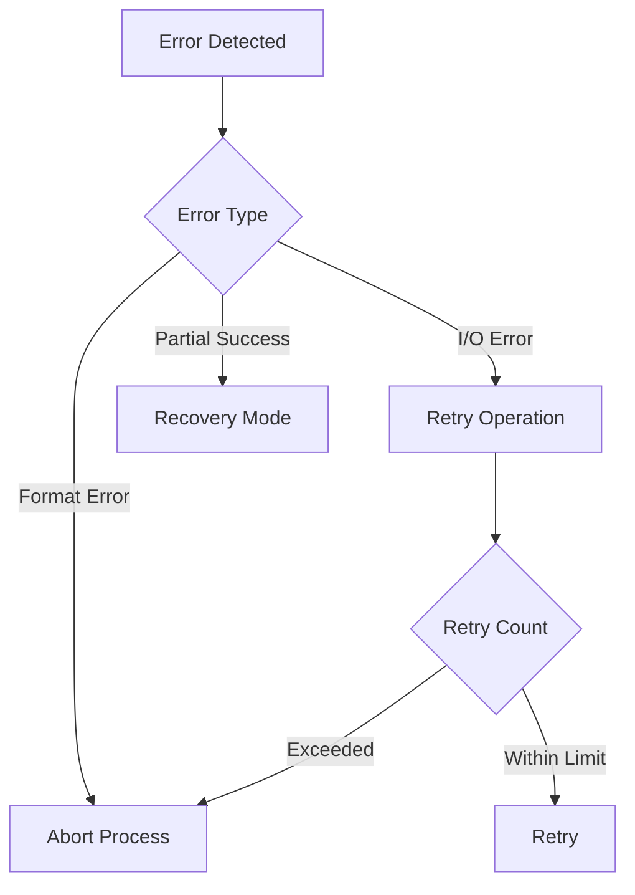
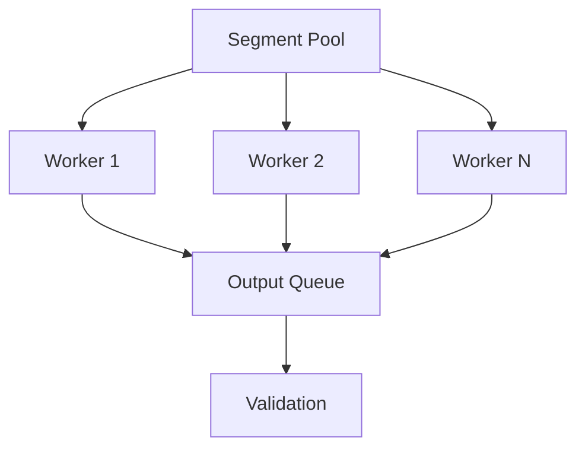
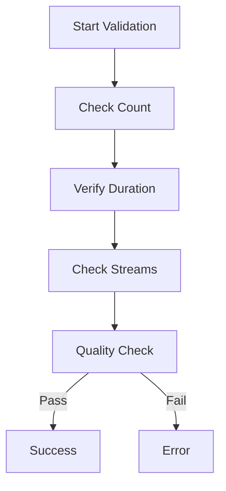

# Video Segmentation Process

## 1. Segmentation Overview



### Process Details
1. **Pre-segmentation Analysis**
   - Duration check
   - Keyframe detection
   - Stream validation

2. **Segmentation Parameters**
   ```python
   # Key configuration
   segment_length: int  # Seconds per segment
   segment_format: str  # Usually 'mkv'
   keyframe_alignment: bool  # Force keyframe alignment
   ```

3. **Output Structure**
   ```
   work_dir/
   ├── segments/
   │   ├── segment_000.mkv
   │   ├── segment_001.mkv
   │   └── segment_NNN.mkv
   └── segment_list.txt
   ```

## 2. Segmentation Error Handling



### Error Categories
1. **Critical Errors**
   - Invalid input format
   - Insufficient space
   - Corrupt video stream

2. **Recoverable Errors**
   - Temporary I/O issues
   - Resource constraints
   - Partial segmentation

3. **Recovery Strategies**
   - Automatic retry
   - Segment validation
   - Cleanup procedures

## 3. Parallel Processing



### Implementation Details
1. **Worker Management**
   - Dynamic worker count
   - Resource monitoring
   - Load balancing

2. **Progress Tracking**
   ```python
   # Progress structure
   {
       'total_segments': int,
       'completed': int,
       'failed': int,
       'current_workers': int
   }
   ```

3. **Resource Control**
   - CPU utilization limits
   - Memory monitoring
   - I/O throttling

## 4. Validation Steps



### Validation Process
1. **Segment Integrity**
   - File completeness
   - Format validation
   - Stream presence

2. **Content Validation**
   - Duration check
   - Frame count
   - Stream consistency

3. **Quality Metrics**
   - Bitrate verification
   - Frame integrity
   - Audio sync

### Validation Rules
```python
# Example validation criteria
{
    'min_duration': segment_length - tolerance,
    'max_duration': segment_length + tolerance,
    'required_streams': ['video'],
    'min_bitrate': threshold_bitrate
}
```

## 5. Recovery Procedures

### Automatic Recovery
1. **Segment Regeneration**
   - Identify failed segments
   - Adjust parameters
   - Retry segmentation

2. **Partial Recovery**
   - Save valid segments
   - Log failed sections
   - Continue processing

3. **Cleanup Operations**
   - Remove invalid segments
   - Update segment list
   - Adjust work files

### Manual Intervention
1. **Failure Conditions**
   - Critical errors
   - Resource exhaustion
   - Format incompatibility

2. **Recovery Steps**
   - Backup valid segments
   - Clear work directory
   - Restart process
