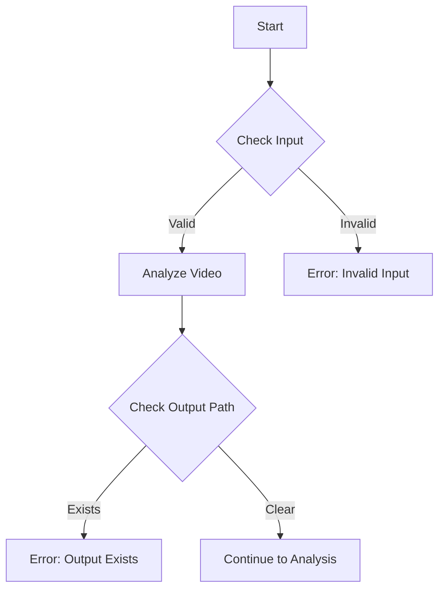
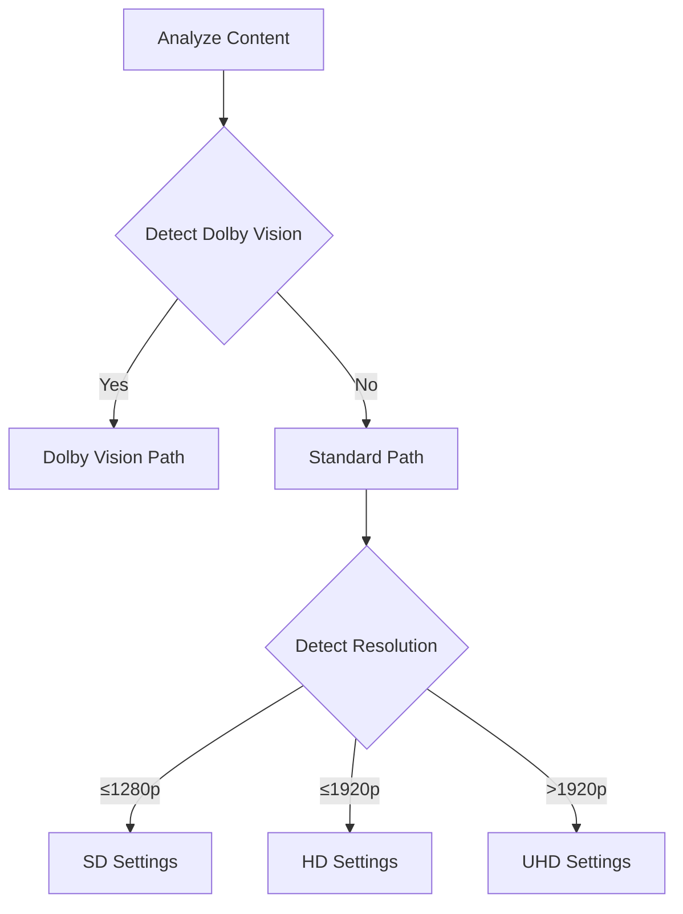
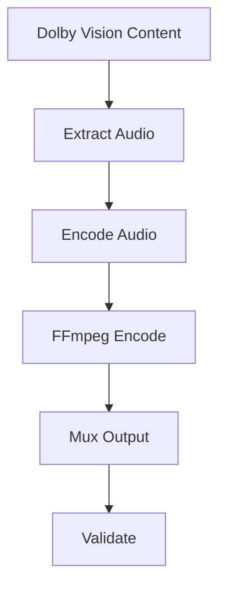
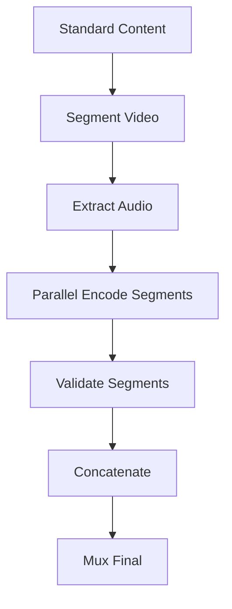
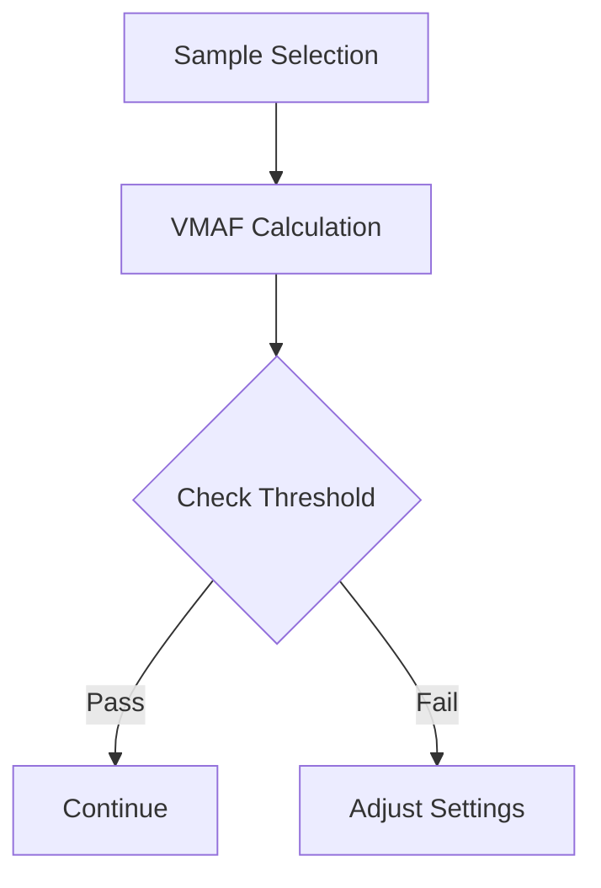
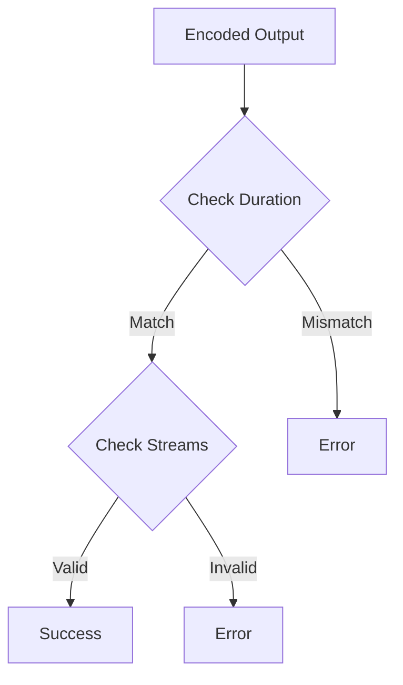
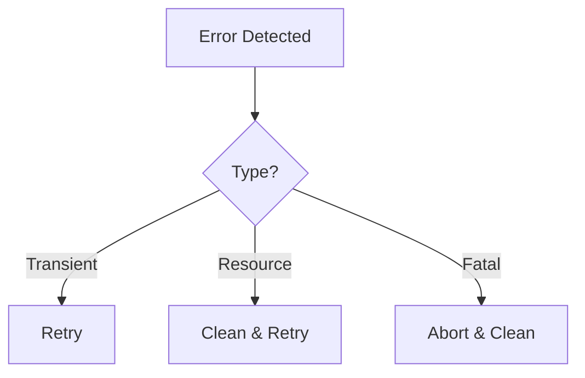

# Drapto Workflow Documentation

## Overview

Drapto implements a sophisticated video encoding workflow with two primary encoding paths:
1. Direct FFmpeg encoding (for Dolby Vision content)
2. Chunked SVT-AV1 encoding (for standard content)

This document details the complete workflow, decision points, and validation checks throughout the encoding process.

## Initial Validation and Analysis

### 1. Input Validation

Checks performed:
- Input file existence and readability
- Output path availability
- File format support
- Required dependencies

### 2. Content Analysis

Analysis includes:
- Dolby Vision detection
- Resolution detection
- Black bar detection (crop)
- Stream analysis (video/audio)

## Encoding Paths

### 1. Dolby Vision Path

Key aspects:
- Direct FFmpeg encoding
- Preserves Dolby Vision metadata
- Single-pass encoding
- Hardware acceleration support

### 2. Standard Path (Chunked SVT-AV1)

Process details:
1. **Segmentation**
   - Scene detection
   - Fixed-size chunks
   - Keyframe alignment

2. **Parallel Encoding**
   - SVT-AV1 encoding
   - Quality-based settings
   - Resource management

3. **Validation**
   - Segment integrity
   - Quality metrics
   - Size verification

## Quality Control

### 1. VMAF Analysis

VMAF checks:
- Sample selection strategy
- Threshold validation
- Quality assurance

### 2. Output Validation

Validation steps:
- Duration matching
- Stream presence
- Format compliance
- Size verification

## Error Handling and Recovery

### 1. Error Categories
- Input validation errors
- Processing errors
- System resource errors
- External tool errors

### 2. Recovery Mechanisms

Recovery strategies:
1. **Segment Failures**
   - Individual retry
   - Skip on threshold
   - Quality adjustment

2. **Resource Management**
   - Workspace cleanup
   - Memory monitoring
   - Disk space checks

## Configuration and Optimization

### 1. Quality Settings
Resolution-based configurations:
- SD (≤1280p): Balanced settings
- HD (≤1920p): Quality focus
- UHD (>1920p): High quality

### 2. Performance Optimization
- Hardware acceleration
- Parallel processing
- Memory management
- I/O optimization

## Workflow Stages

1. **Initialization**
   - Config validation
   - Dependency checks
   - Resource allocation

2. **Pre-processing**
   - Format analysis
   - Stream detection
   - Crop detection

3. **Processing**
   - Audio extraction
   - Video encoding
   - Progress monitoring

4. **Post-processing**
   - Quality validation
   - Stream muxing
   - Cleanup operations

## Common Issues and Solutions

1. **Resource Constraints**
   - Memory management
   - Disk space monitoring
   - CPU utilization

2. **Quality Issues**
   - VMAF analysis
   - Encoding adjustment
   - Format verification

3. **Performance Optimization**
   - Parallel processing
   - Hardware acceleration
   - I/O management

## Best Practices

1. **Input Preparation**
   - Format verification
   - Stream analysis
   - Resource check

2. **Encoding Configuration**
   - Resolution-based settings
   - Quality targets
   - Resource allocation

3. **Validation**
   - Quality metrics
   - Stream integrity
   - Format compliance
